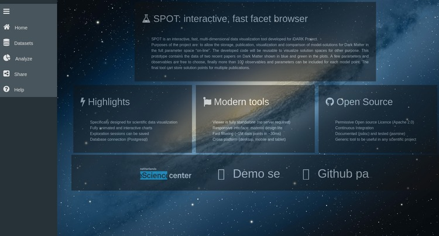
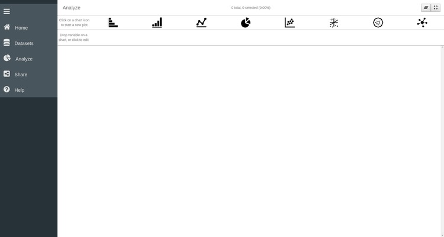
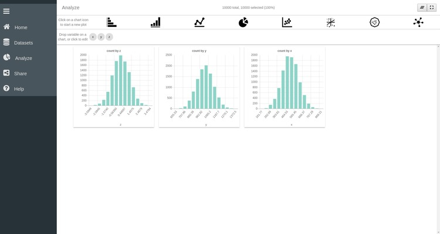
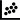
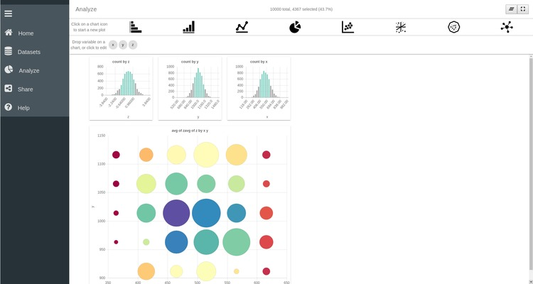
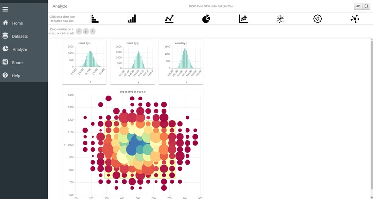
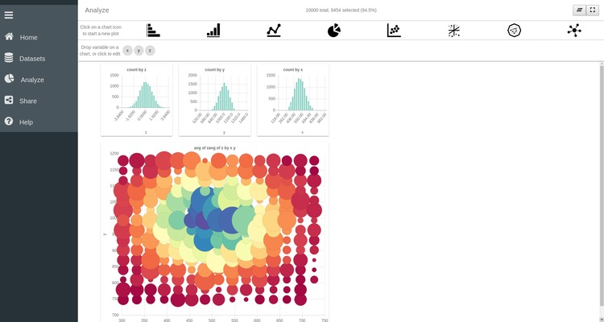
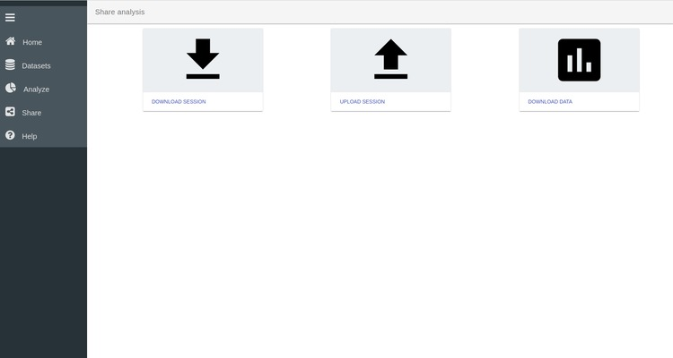

# SPOT : A Basic Tutorial

Spot is an interactive visualization tool for multidimensional data. It allows to quickly analyse complex data sets. For this example we will us a simple example pof a .csv file containing 3 facets (i.e. columns) containing the values of 3 rando variables. 


```python
import numpy as np
N = 10000
x1 = np.random.normal(loc=5.0,size=N) * 100
y1 = np.random.normal(loc=10.0,size=N) * 100
z1 = np.random.normal(loc=0.0,size=N)
np.savetxt('simple_data.csv',np.array([x1,y1,z1]),header='x, y, z',delimiter=', ')
```

Go to the SPOT directory and start the server

```
npm run templates
npm start
```

Then open your web browser and go to localhost:9966. The home page of SPOT should be displayed. 

---


## Homepage



The home page of SPOT highlights the main features of the tool. 
The workflow of a SPOT session is made out of three main steps:
1. **Load the dataset**
   You can load a CSV or a JSON file or connect to a postgres database

2. **Anaylse the data**
   Exploit the native SPOT features to plot and explore one or multiple data set

3. **Share the information**
   Export your data and/or ypur entire SPOT session or Upload a previous SPOT session

You can easily navigate along these three steps from the menu left. A detailled descritpion of individual steps of the worflow is given below.

 ** Demo Session **

 By clicking the icon a demo file will be feteched on-line and automatically uploaded on the active SPOT session. This way, you can have a quick look at a final session in a simple click !

 **GitHub Page**

Go to the SPOT Github page to clone the repository and interacts with our developpers


___

## Step 1. Load your data 


To load your data into the app, click on the **Datasets** in the side menu. Three options are available to load your data in SPOT.

  1. **Connect to a server** You can connect to a dabase where your dataset is stored

  2. **Upload a JSON file** You can uplaod a simple JSON file 

  3. **Upload a CSV file**. You can upload a simple CSS file. 
  Several options are accessible bu clicking on the weel icon [](./csv_options.jpg). You can specify how the columns are delimited and if there is a specific header in the file or not.


For our purpose we are going to uplaod the CSV file we have created above. To do that click on the CSV button and navigate to the file in the popup window. Once open you have the possibility to delete the data set or edit its properties by clicking on the its setting icon.  This will open the Edit page of the data. In our case this dataset only contains 3 facets called _x_,_y_ and _z_. These names corresond to the header of the csv file we have created above. By clicking on the box of a given facet you can edit its properties, for example change its name of facets or remove it.


## Step 2. Analyze your data

The main feature of SPOT is its ability to easily plot and explore the data using cross-plot selection. To start plotting your data and exploring its facets click on  **Analyze** in the left menu bar.  From this page you can create, edit and interact with different plots. 



On the top of the page you have access to different plotting function ranging from simple histograms to more advanced network charts. Below this, are the facets (also called variables) that are present in the data set. You can recognise here the three variables _x_,_y_ and _z_.


### Simple histogram plots

In this simple example we are first going to create three histograms of the variables _x_, _y_ and _z_. To do so:

  1. Click on the Bar Chart  icon to create a first histogram plot. 
  2. Drag the variable x to the *Group by* box on the plot. 


This will create an histogram of the _x_ variable. To finalize the visualization of this plot and interact with it, click on the settings weel icon   located on the top right corner of the plot. Clicking on this image allows switching between an edit mode and a view mode of the plot. Repeat the same operations for the the two other variables to create histrograms of their values. You can freely move the windows to align them horizontally



### Customizing plots

It is possible to customize the appearance of each plot. Return to Edit mode by clicking on the weel in th top right corner . Then click on the *Group by* box of one of the histogram to open the configuration of this plot. There you can change the range of the x-axis, specify the number of bins you want for the histogram and many more options. For example here we sepcify that the x axis should range between -4 and 4 and contains 25 bins. Click on **Analyze** in the left menu bar to return to your plot.


### Scatter plot

SPOT also allows for more advanced plotting functions such as line plots, 2D and 3D scatter plots, network plot etc ... We are here going to create a scatter plot of _x_ versus _y_. 

  1. Click on the bubble-chart icon 
  2. Drag the x variable in the *X axis* box of the new plot 
  3. Drag the y variable in the *Y axis* box of the new plot
 
As before click on the setting weel  of the plot to finalize its visualization. One important thing to remember is that SPOT only plots binned data. Hence each plot on the scatter plot represent here the aggregation of multiple data point. The binning of the splot can be customized by clicking on the *X axis* box. There you can specify the range of the x axis as well as the number of bins required along the axis. The same thing can be done for the y-axis. 


As you can see other options are available to configure the scatter plot. You can for example control the point color and the point size using one of the variable. To understand the effect of these options drag the _z_ variable to the *Point color* box of the scatter plot. Each point is now colored according to the values of the _z_ variables. Several modes are accessible by clicking on the *Point Color* box. Namely the color of each point can represent the average, sum, standard deviation of the z-values, or simply the number of points it aggregates. We can also use the values of the _z_ variables to control the size of the points by dragging the _z_ variable in the *Point size* box of the plot.


### Dynamic Data Selection

One of the main strength of SPOT is the possibility to slice through your data simultaneously accros different plots. This enables you to get a better understanding of the underlying structure of your dataset and to easily discover new relations hidden in the vast ammoung of information it contains.

To understand what _slicing accross multiple plots_ means, select a range ox values by clicking on individual bars in the bar chart of the _x_ variable. Repeat the same operation on the two remaining bar charts to select value ranges for the _y_ and _z_ variable. As you can see the 2D scatter plot is automatically adjusted to only represent the data points that were selected in the different bar charts.




You can remove the selection by pressing the undo button  on the top left corner of the plot.

### Dive in your data

How already mentionned earlier, the data plotted in the SPOT plots are binned. Hence a single point or bar represent the aggregation of multiple data point. It is possible with SPOT to dive in your data by progressively zooming in a specified area of the plot. For example in the 2D scatter plot you can select the central region of the plot by clicking on different point of the plot. The selected area appear as a yellow rectangle on the plot.



An important feature of SPOT is the possiblity to zoom in and out of your data to obtain a more detailled or a more general representation of the data. To navigate inside your dataset use the two buttons on the top left corner of the plot

  *  *Zoom In* Ony plot the part of the dataset that is selected and update the plot. By clicking ou can litteraly dive in your data and progrssively zoom inside your data set until each bar or point only represent one single data point. 

  *  *Zoom out* Return to the previous level of details and update all the plots. You can progressively zooming out of your data until the entire dataset is represented on the plot.





## Step 3. Download the session

Once you are satisfy with your SPOT session you can export the data and/or the entire SPOT session in a JSON format. YOu can access the export page by clicking on *Share* in the left menu bar.

This page allows you to export the data and export the session. This session file can also be re-uploaded through the Upload Session button to restart a previous SPOT session and continue the data exploration.

